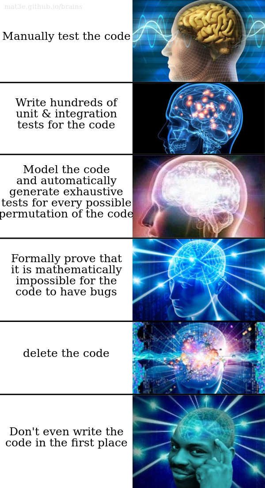

Push Streams

---

# @dominictarr (github/twitter)

* wrote some modules
* security auditing: leastauthority.com
* ssb: @EMovhfIrFk4NihAKnRNhrfRaqIhBv1Wj8pTxJNgvCCY=.ed25519
* live on sailboat in New Zealand

---


# "Streams are node's best and most misunderstood idea"

- dominictarr (2011, from event-stream readme, still true)

---

what is a stream?

* Array but in time not space

* source -> through... -> sink

* back pressure: the source slows down if the sink does

* error handling, hopefully

---

error handling, eg: downloading a file

* source fails (wifi drops)
* through fails (invalid format, parsing error)
* sink fails (disk is full)

---

node streams

* [events.js](https://github.com/nodejs/node/blob/master/lib/events.js)
* [_stream_readable.js](https://github.com/nodejs/node/blob/master/lib/_stream_readable.js)
* [_stream_writable.js](https://github.com/nodejs/node/blob/master/lib/_stream_writable.js)
* ...

---

# other problems

* back pressure is delayed
* ...all streams must buffer
* no error propogation

---

# early alternatives

* [gozala/reducers](https://github.com/gozala/reducers) (2012)
* [dominictarr/strm](https://github.com/dominictarr/strm) (2013)

---

# [pull-streams](https://github.com/pull-stream/pull-stream) (2013)

* secure-scuttlebutt
* ipfs
* js-git (min-streams, by @creationix)

---

# problems

* stackoverflow if source is sync (fixed, but ugly)
* aborting live stream (fixed)
* memory use of closures
* abort stalled sink
* difficult to port to other languages

---

## push-streams

* uses iteration, faster/lighter than recursion
* OO style, more optimized
* stream can end / abort any time.
* easy to implement in any OO language

---

## collect (sink)

``` js
function collect(cb) {
  var ary = []
  return {
    write: ary.push.bind(ary),
    paused: false,
    end: function (err) {
      this.ended = err || true
      cb(err, ary)
    }
  }
}
```

---

## values (source)


``` js
function values (ary) {
  var i = 0
  return {
    resume: function () {
      //just loop until the sink pauses or we have ended
      while(!this.sink.paused && !this.ended)
        if(this.ended = i >= ary.length) this.sink.end()
        else                             this.sink.write(ary[i++])
    },
    sink: null,
    pipe: pipe
  }
}
```

---

## pipe

``` js
function pipe(sink) {
  this.sink = sink
  sink.source = this
  if(!sink.paused) this.resume()
  return sink
}
```

---

## a simple pipeline

```
var source = values([1,2,3])
var sink = collect(function (err, ary) { console.log(ary) })

source.pipe(sink)
```

---

## map stream

``` js
function map(fn) {
  return {
    write: function (data) {
      //we trust the source not to call us if we are paused
      //so we don't need to buffer this.
      this.sink.write(fn(data))
      this.paused = this.sink.paused //update our pause state if it changed
    },
    end: function (err) {
      this.ended = true
      this.sink.end(err)
    },
    //a map needs to start off paused
    paused: true,
    //the sink will call resume when it unpauses.
    resume: function () {
      if(!(this.paused = this.sink.paused))
        this.source.resume()
    },
    pipe: pipe,
    source: null, sink: null
  }
}
```

---

## piped

```
var source = values([1,2,3])
var sink = collect(function (err, ary) { console.log(ary) })
var through = map(function (e) { return 10 * e })
source.pipe(through).pipe(sink)
```


---

## async map

``` js
function asyncMap (asyncFn) {
  var _map = map()
  _map.write = function (data) {
    //we trust the source not to call us if we are paused
    //so we don't need to buffer this.
    var self = this
    self.paused = true
    asyncFn(data, function (err, mapped_data) {
      self.paused = false
      if(err) self.sink.end(this.ended = err)
      else {
        self.sink.write(mapped_data)
        self.resume()
      }
    })
  }
  return _map
}
```

---

## Back Pressure

* sink has `paused` property.
* source checks `this.sink.paused` before writing
* through sets `this.paused = this.sink.paused` after writing

---

## Error Handling


``` js
function values (ary) {
  var i = 0
  return {
    ...
    abort: function (err) {
      this.ended = true
      this.sink.end(err)
    }
  }
}
```

``` js
function map(fn) {
  return {
    ...
    abort: function (err) {
      this.source.abort(err)
    }
  }
}
```

---

## benchmarks

``` js
> node pull-stream/benchmarks/node.js
pull3*100000: 4470.156ms
> node pull-stream/benchmarks/pull.js
pull3*100000: 640.037ms
> node push-stream/benchmarks/push.js
pull3*100000: 226.907ms
```

---

## fixing node

* Q: shall we replace node streams? A: no.

---

# npm better than core

* just rewrite core modules and install via npm
* then you have versions for core modules

---

* why use > 1000 loc when you can use < 100 ?
* less code means less bugs
* probably faster
* more readable

---


